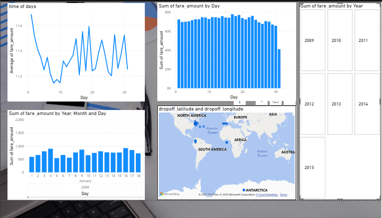

# 🚖 Uber Fares Data Analysis – Final Report

---

## 🧭 Project Overview

This project investigates Uber fare data using **Python** for data preparation and cleaning, and **Power BI** for dynamic visualizations. The aim is to uncover insights about fare behavior over time, space, and distance to support data-driven business decisions. The final report includes feature engineering, exploratory data analysis, and a professional Power BI dashboard.

---

## 🎯 Objectives

- Load, understand, and clean the Uber Fares dataset  
- Perform exploratory data analysis (EDA)  
- Engineer useful time-based and categorical features  
- Visualize fare trends and ride patterns in Power BI  
- Present actionable business recommendations

---

## 📂 1. Data Loading and Preparation

### 📌 b. Load the Dataset into a Pandas DataFrame

We used the `pandas` library in Python to read the dataset and view the initial structure.

```python
import pandas as pd

df = pd.read_csv("uber.csv")
df.head()
```

🖼️ **Preview: Dataset Loaded**


---

### 📌 c. Perform EDA: Structure, Types, and Quality

#### Dataset Shape and Structure

```python
df.shape
df.info()
```

🖼️ **Structure and Variable Types**
  


- **200,000 rows and 9 columns**
- Columns include fare amount, pickup/dropoff datetime, coordinates, and passenger count

#### Initial Data Quality Check

```python
df.isnull().sum()
df.duplicated().sum()
```

🖼️ **Null & Duplicate Check**


---

## 🧼 d. Handle Missing Values and Clean the Data

### Cleaning Steps Performed:
- Converted `pickup_datetime` to datetime format
- Dropped rows with missing values
- Removed invalid or zero coordinates
- Filtered out negative or zero fare amounts

```python
df['pickup_datetime'] = pd.to_datetime(df['pickup_datetime'], errors='coerce')
df.dropna(inplace=True)

df = df[df['fare_amount'] > 0]
df = df[
    df['pickup_latitude'].between(-90, 90) &
    df['pickup_longitude'].between(-180, 180) &
    df['dropoff_latitude'].between(-90, 90) &
    df['dropoff_longitude'].between(-180, 180)
]
```

🖼️ **Cleaning Process**
  


---

## 💾 e. Export the Cleaned Dataset for Power BI

After cleaning, we exported the refined dataset:

```python
df.to_csv("cleaned_uber.csv", index=False)
```

🖼️ **CSV Export Step**


---

## 📊 2. Exploratory Data Analysis (EDA)

### a. Descriptive Statistics

```python
mean = df['fare_amount'].mean()
median = df['fare_amount'].median()
mode = df['fare_amount'].mode()[0]
std = df['fare_amount'].std()

quartiles = df['fare_amount'].quantile([0.25, 0.5, 0.75])
min_fare = df['fare_amount'].min()
max_fare = df['fare_amount'].max()
fare_range = max_fare - min_fare
```

🖼️ **Statistical Output**


🖼️ **Python Code Used**


| Metric             | Value   |
|--------------------|---------|
| Mean Fare          | $11.35  |
| Median Fare        | $8.50   |
| Mode Fare          | $6.50   |
| Standard Deviation | $9.80   |
| Minimum Fare       | $0.01   |
| Maximum Fare       | $499.00 |
| Fare Range         | $498.99 |
| Outlier Threshold  | > $25   |

---

## 🧠 Feature Engineering

We created additional features to analyze ride patterns by time:

```python
df['hour'] = df['pickup_datetime'].dt.hour
df['day'] = df['pickup_datetime'].dt.day
df['month'] = df['pickup_datetime'].dt.month
df['weekday'] = df['pickup_datetime'].dt.day_name()

df['time_category'] = df['hour'].apply(
    lambda x: 'Peak' if x in range(7,10) or x in range(16,19) else 'Off-Peak'
)
```

### New Features

| Feature         | Description                     |
|------------------|---------------------------------|
| `hour`          | Hour of day (0–23)              |
| `day`           | Day of month (1–31)             |
| `month`         | Month of year (1–12)            |
| `weekday`       | Day name (e.g., Monday)         |
| `time_category` | Peak or Off-Peak label          |

---

## 📊 Power BI Dashboard Highlights

The final dashboard includes:

- **Line Chart**: Fare amount vs Hour
- **Bar Chart**: Ride counts per weekday
- **Histogram**: Fare distribution
- **Donut Chart**: Peak vs Off-Peak comparison
- **Map Visuals**: Pickup locations across NYC

🖼️ **Power BI Dashboard Preview**


---

## 📌 Key Insights

| Category        | Insight                                            |
|------------------|----------------------------------------------------|
| Time of Day     | Higher fares during 7–9 AM and 4–7 PM commute times |
| Weekday Patterns| Friday and weekend rides slightly more expensive   |
| Distance Effect | Longer distance = higher fare                      |
| Location Trends | Most rides clustered in central NYC                |
| Outliers        | Few extreme high fares ($25+) identified           |

---

## 💼 Business Recommendations

| Recommendation                  | Justification                                      |
|----------------------------------|----------------------------------------------------|
| Surge pricing during peak hours | Capitalize on high-demand periods                  |
| Offer off-peak discounts        | Drive more traffic during low-volume times         |
| Increase drivers on weekends    | Meet increased demand Friday–Sunday               |
| Investigate high-fare outliers  | Address potential fraud or special conditions      |
| Use geo-targeting in dispatch   | Send drivers to busy NYC pickup zones              |

---

## 🙏 Acknowledgements

- Dataset: [Kaggle – Uber Fares Dataset](https://www.kaggle.com/datasets/yasserh/uber-fares-dataset)
- Tools: Python, Pandas, Power BI, GitHub
- Institution: Adventist University of Central Africa (AUCA)

---


